# Song GPT

**Song GPT** is an AI-powered platform designed for musicians, songwriters, and music enthusiasts to create unique and inspiring songs. Whether you're a seasoned professional or a beginner, Song GPT provides tools to bring your musical ideas to life.

## Table of Contents
- [Features](#features)
- [Getting Started](#getting-started)
  - [Prerequisites](#prerequisites)
  - [Installation](#installation)
  - [Firebase Setup](#firebase-setup)
- [Available Screens and Widgets](#available-screens-and-widgets)
- [Screenshots](#screenshots)
- [Contributing](#contributing)
- [License](#license)

## Features

- **Theme Toggle**: Switch between light and dark modes for a comfortable user experience.
- **AI-Powered Song Creation**: Generate custom song ideas based on user inputs, including mood, genre, and more.
- **Song Categories**: Organized song categories for easy browsing.
- **Customizable Profile**: Set your artist name and manage personal info.
- **In-App Audio Player**: Control song playback with skip, repeat, and playlist features.
- **Auth Integration**: Secure login and signup using Firebase authentication.
- **UI Customization**: Dynamic theme management, animations, and a visually appealing interface.

## Getting Started

### Prerequisites
1. [Flutter](https://flutter.dev/docs/get-started/install) installed on your machine.
2. A Firebase project set up with a `google-services.json` file in the `android/app` directory.

### Installation
1. **Clone the Repository**:
   ```bash
   git clone https://github.com/your-username/song-gpt.git
   cd song-gpt

2. **Install Dependencies**:
   ```bash
   flutter pub get
   ```

3. **Run the App**:
   ```bash
   flutter run
   ```

### Firebase Setup
1. Go to the [Firebase Console](https://console.firebase.google.com/) and create a new project.
2. In the Firebase project, add an Android app and download the `google-services.json` file.
3. Place `google-services.json` in the `android/app` directory.
4. Update the `android/build.gradle` and `android/app/build.gradle` files according to the Firebase setup instructions.

## Available Screens and Widgets

- **HomeScreen**: Displays song categories and a search bar.
- **SongDetailScreen**: Shows song details with lyrics, playback controls, and more.
- **ProfileScreen**: User’s profile management, including name and album details.
- **LoginScreen** and **RegisterScreen**: For user authentication.
- **CustomDrawer** and **FullScreenMenu**: Custom navigational menus with theme toggle and auth controls.

## Screenshots

### Home Screen
| Home Screen 1                       | Home Screen 2                       | Home Screen 3                       | Home Screen 4                       |
|-------------------------------------|-------------------------------------|-------------------------------------|-------------------------------------|
|  | 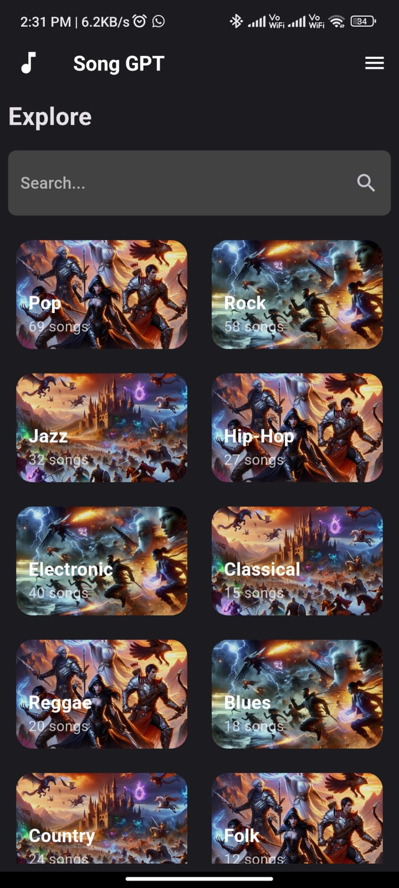 | 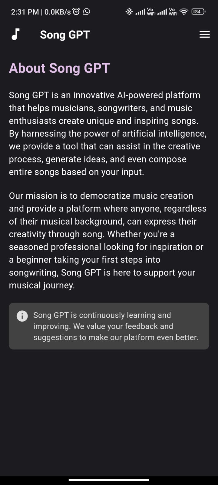 | 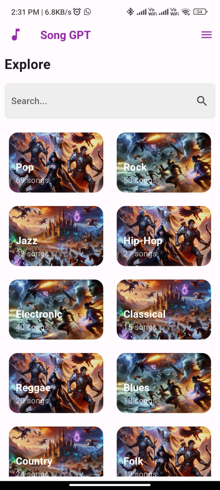 |

### Create Song
| Create Song 1                       | Create Song 2                       | Create Song 3                       | Create Song 4                       |
|-------------------------------------|-------------------------------------|-------------------------------------|-------------------------------------|
| 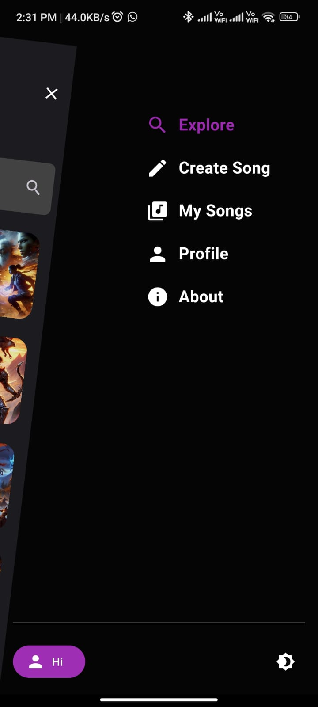 | 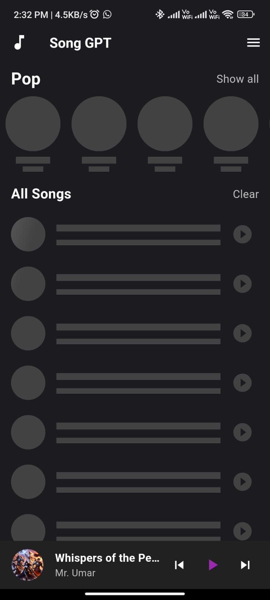 | 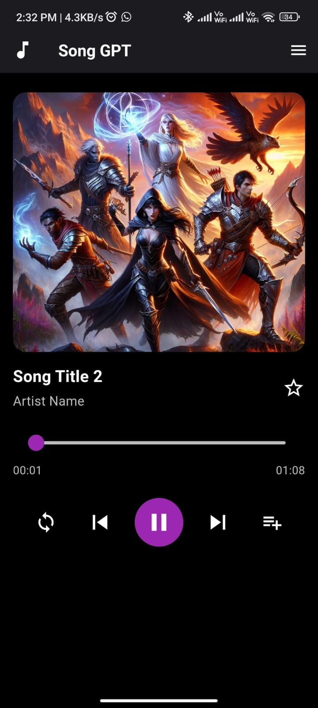 | 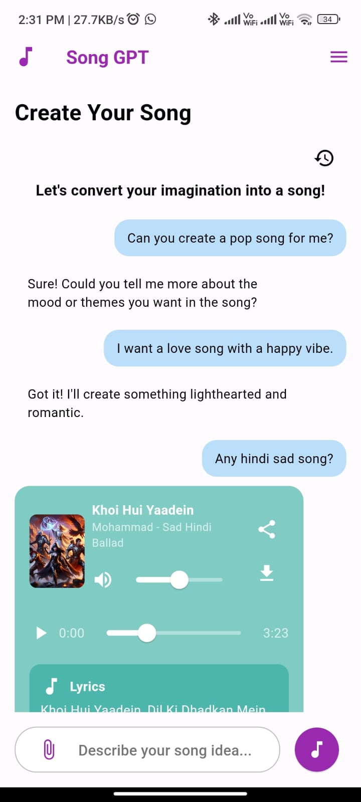 |

### Profile Screen
| Profile Screen 1                    | Profile Screen 2                    | Profile Screen 3                    | Profile Screen 4                    | Profile Screen 5                    |
|-------------------------------------|-------------------------------------|-------------------------------------|-------------------------------------|-------------------------------------|
| 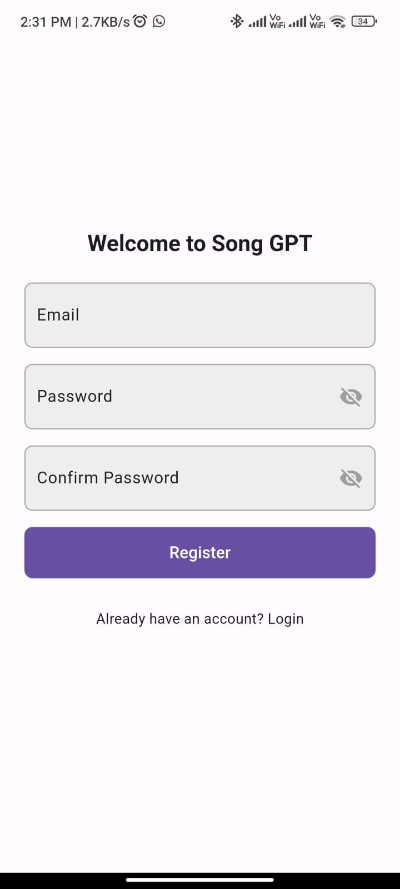 | 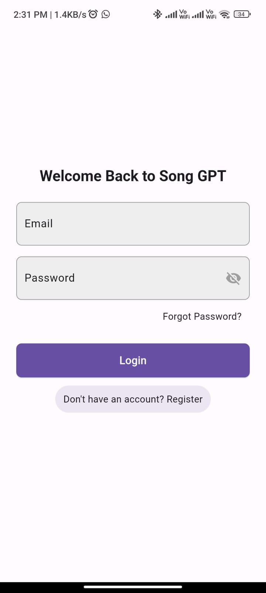 | 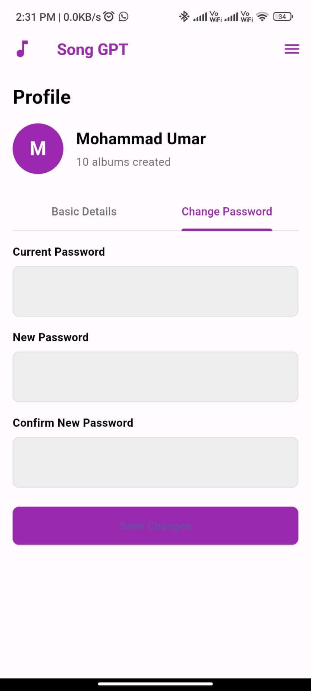 | 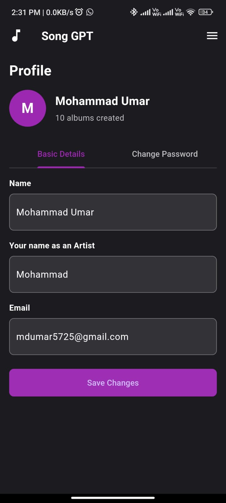 | 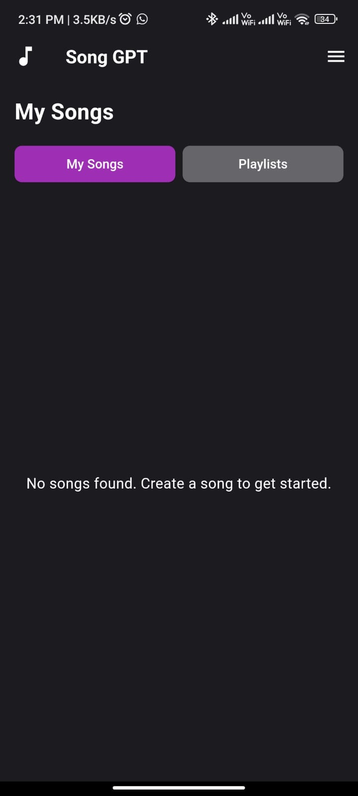 |


## Contributing

We welcome contributions to improve Song GPT! Please follow these steps:

1. **Fork the repository.**
2. **Create a new branch** for your feature or bug fix:
   ```bash
   git checkout -b feature/your-feature-name
   ```
3. **Commit your changes** and push them to your fork.
4. **Open a pull request** on the main repository.

## License

This project is licensed under the MIT License. See the [LICENSE](LICENSE) file for details.

